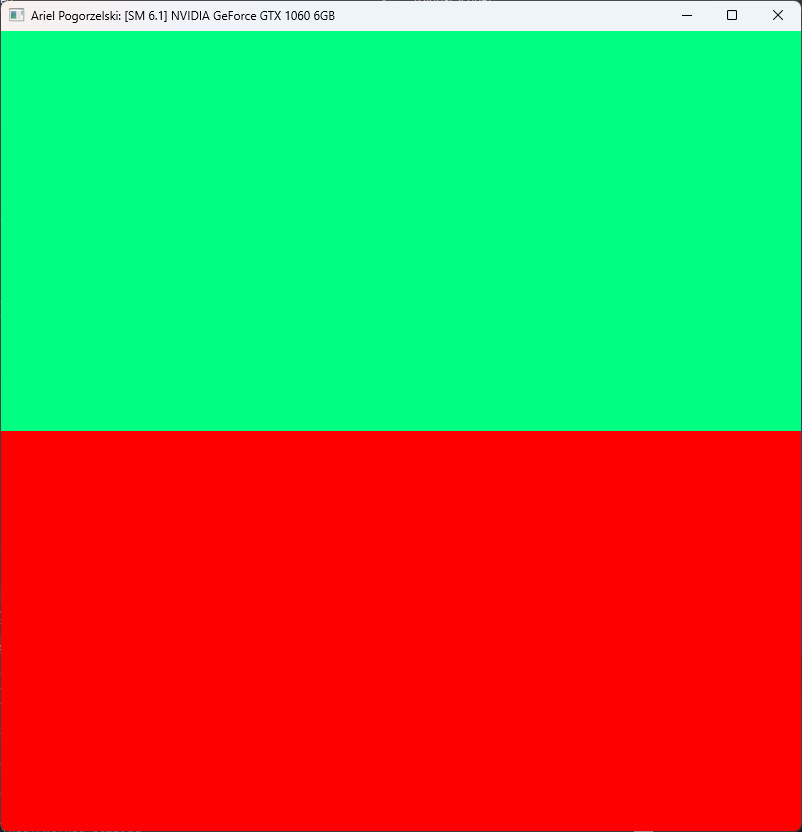
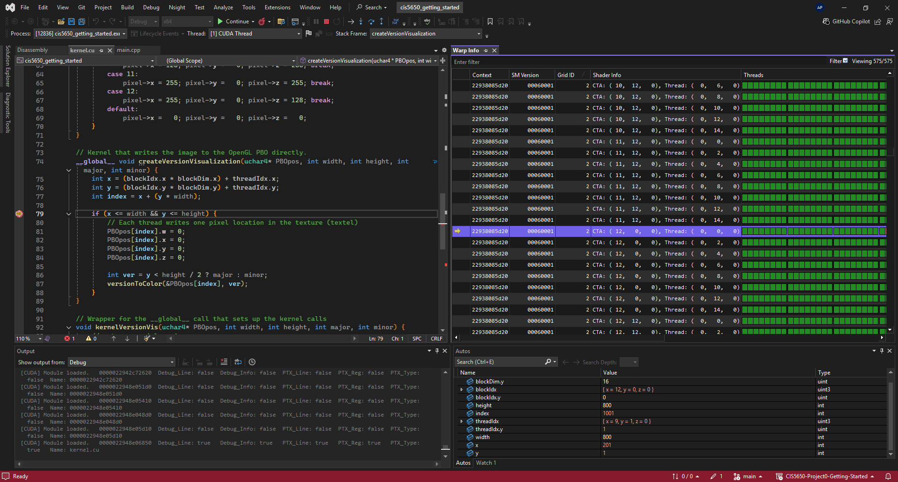
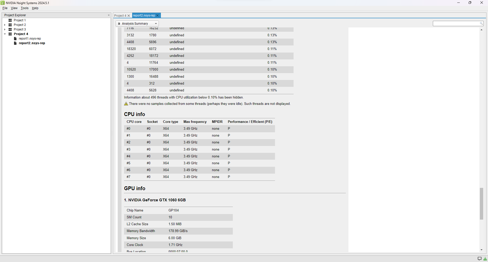
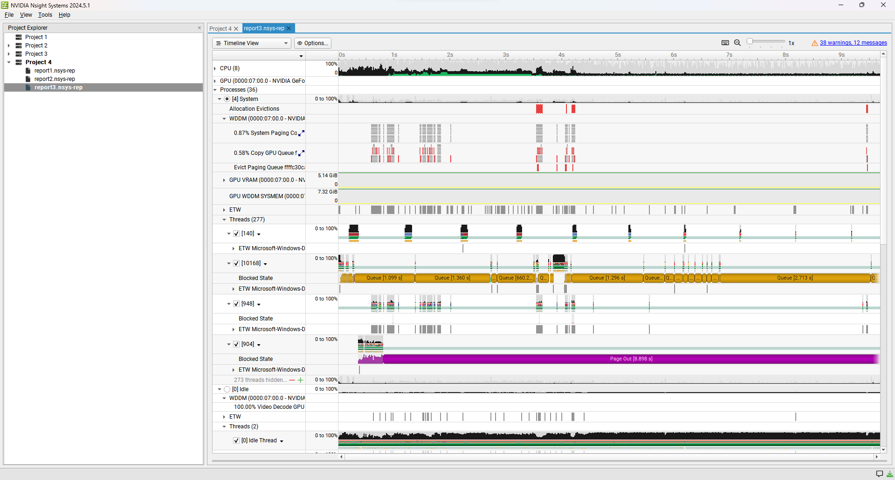
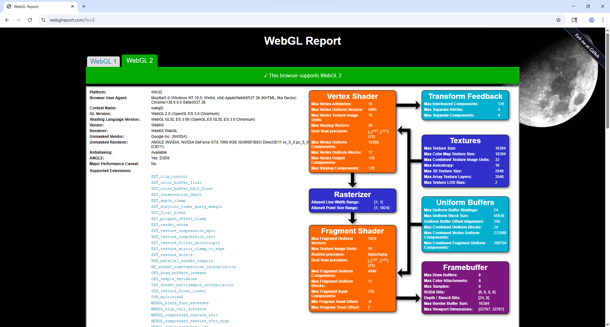
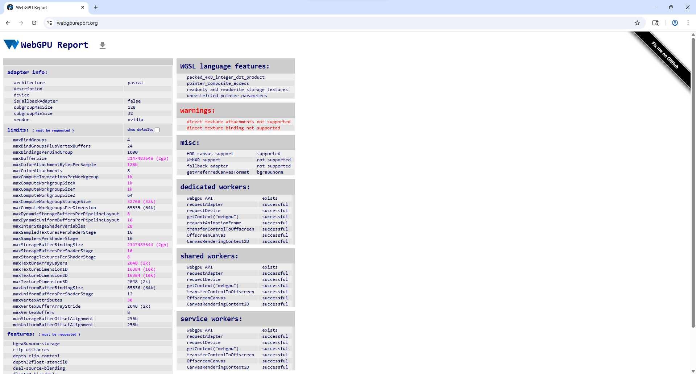

Project 0 Getting Started
====================

**University of Pennsylvania, CIS 5650: GPU Programming and Architecture, Project 0**

* Ariel Pogorzelski
  * [LinkedIn](https://www.linkedin.com/in/ariel-pogorzelski/)
* Tested on: Windows 11 Nvidia GTX 1060 (personal computer)

# Results
### 1. Window with my name

### 2. Nsight debugger in VS

### 3. Nsight Systems

### 4. Nsight compute
Nsight compute [does not support](https://forums.developer.nvidia.com/t/using-nsight-compute-2019-5-0/236188/4) Pascal architecture GPUs. I downgraded to Nsight compute 2019.5.1, it still said my GPU was not supported.

### 5. WebGL

### 6. WebGPU

